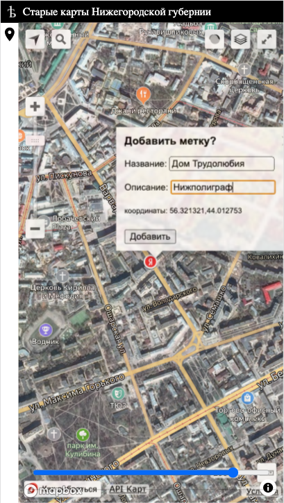
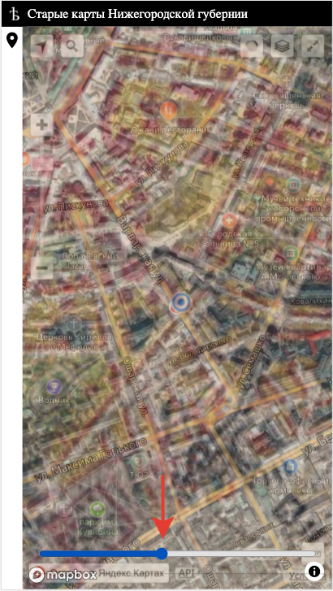
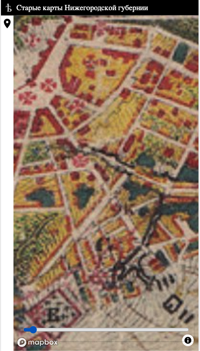

# Map NN

The purpose of this project is to demonstrate possibility to compare old map of Nizhegorodskaya Guberniya and modern (Yandex Map)[https://maps.yandex.ru/]

For base map layer I used Mende map form [etomesto.ru](http://www.etomesto.ru/map-nn_mende) and this simple [tiles service](https://github.com/mikhail-angelov/mapnn-tiles)

Live version is deployed here [mapnn.vercel.app](https://mapnn.vercel.app)

Simple screens

one layer|both|other layer
---|---|---
 | |

## Dev stack
- UI: (preact)[https://github.com/preactjs/preact] (htm)[https://github.com/developit/htm]
- Map: (mapbox)[https://github.com/mapbox/mapbox-gl-js]
- Yandex map: (yamp)[https://yandex.com/dev/maps/jsapi/doc/2.1/quick-start/index.html]
- Deployment: (Awesome Vercel)[https://vercel.com]

## To repeat this app
- install (node.js)[https://nodejs.org]
- clone this repo
- `npm i`
- rename `env.json.example` --> `env.json`
  - set `mapBoxKey` from [here](https://docs.mapbox.com/help/tutorials/get-started-tokens-api/)
  - set `yandexMapKey` from [here](https://developer.tech.yandex.ru/services/)
  - set `mapnnUrl` tiles source url (compatible with MapBox) I use my [service](https://mapnn.bconf.com/map/mende/{z}/{x}/{y}.jpg)
  - other settings are optional
- install and login via [Vercel CLI](https://vercel.com)
- run: `vercel --prod`
- profit

## Feedback
Your feedback is welcome, if you like to improve this app somehow, submit an [issue](https://github.com/mikhail-angelov/mapnn/issues).